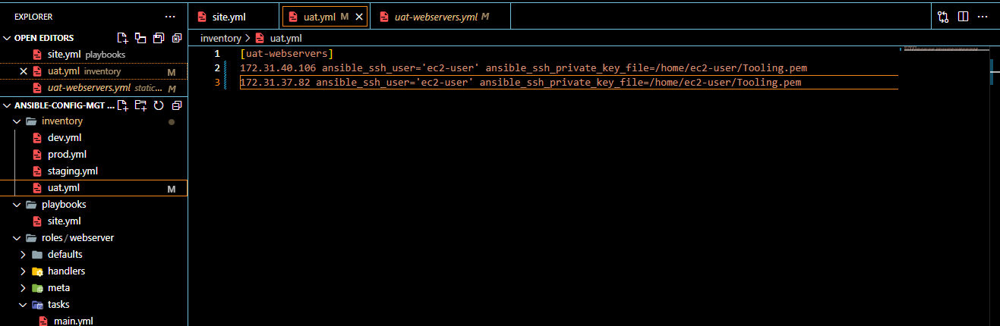
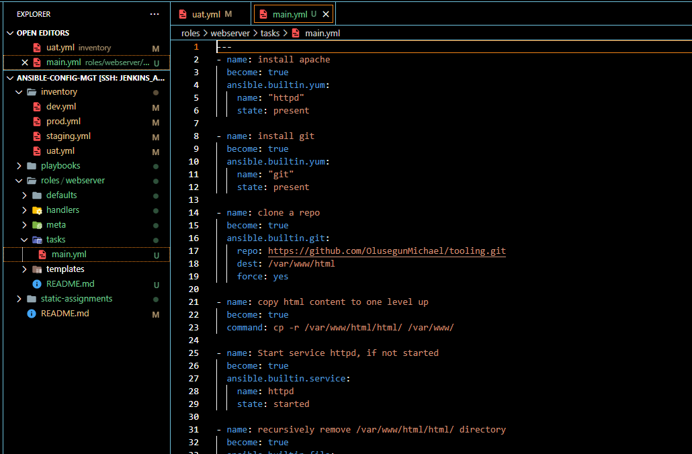

____
## **Project_12_Ansible Refactoring Assignments & Imports**
____
____
### **Step 1 - Jenkins job enhancement**
___
>### On Jenkins-Ansible server create a new directory.

On the Jenkins-Ansible server and a new directory is created called ansible-config-artifact – the directory will store all artifacts after each build.
Using Command 
* *`sudo mkdir /home/ubuntu/ansible-config-artifact`*

>### Change permissions to this directory
Permission has to be chnaged so Jenkins could save files to the directory
*  *`chmod -R 0777 /home/ubuntu/ansible-config-artifact`*

>### On Jenkins web console Install Jenkins Artifact
Go to Jenkins web console -> Manage Jenkins -> Manage Plugins -> on Available tab search for Copy Artifact and install this plugin without restarting Jenkins

>### Create a new Freestyle project
A new freestyle project named save_artifacts  is created and will be triggered by completion of your existing ansible project

>### Create a Build step to save artifacts into specified Directory
The main idea of save_artifacts project is to save artifacts into /home/ubuntu/ansible-config-artifact directory. To achieve this, I created a Build step and choose Copy artifacts from other project, specify ansible as a source project and /home/ubuntu/ansible-config-artifact as a target directory.

>### Test your set up by making some change in README.MD 

Inside the README.MD file in ansible-config-mgt repository (right inside master branch) i made some changes so as to confirm If both Jenkins jobs have completed one after another and the change can also be seen on then *`ansible-config-artifact/`* Directory

___
### **Step 2- Refactor Ansible Code by Importing Other Playbooks into site.yml** 
___
Before starting to refactor the codes, I ensure that you have pulled down the latest code from master branch to the feature/project-11-ansible branch.

>#### I created a New Branch called refactor

DevOps philosophy implies constant iterative improvement for better efficiency – refactoring is one of the techniques that can be used, but you always have an answer to question "why?". Why do we need to change something if it works well?

>#### Code re-use in action by importing other playbooks
* Within playbooks folder, create a new file and name it site.yml – This file will now be considered as an entry point into the entire infrastructure configuration 
* I Create a new folder in root of the repository and name it static-assignments. The static-assignments folder is where all other children playbooks will be stored. This is merely for easy organization of your work.
* I Move common.yml file into the newly created static-assignments folder.

* Inside site.yml file, import common.yml playbook. which uses built in import_playbook Ansible module.

* The folder structure is captured below;

>#### Run ansible-playbook command against the dev environment

* I Created another playbook under static-assignments and named it common-del.yml. In this playbook, configure deletion of wireshark utility.

* The site.yml is updated with import_playbook: ../static-assignments/common-del.yml and wa run against dev servers.

* Using command *`ansible-playbook -i inventory/dev.yml playbooks/site.yml`* the playbook was ran.

* Confirm Wireshark is Uninstalled

___
### **Step 3 – Configure UAT Webservers with a role ‘Webserver’**
___
* Launch 2 fresh EC2 instances using RHEL 8 image
 I will use them as my uat servers, and name them accordingly – Web1-UAT and Web2-UAT
 
 

 * Using  Ansible utility called ansible-galaxy inside ansible-config-mgt I create roles directory upfront and initiated the webserver using the below commands;
    * *`mkdir roles`*
    * *`cd roles`*
    * *`ansible-galaxy init webserver`*

* After removing unnecessary directories and files, the roles structure looks like this

* Updated my inventory ansible-config-mgt/inventory/uat.yml file with IP addresses of the 2 UAT Web servers.

* In /etc/ansible/ansible.cfg file I uncomment roles_path string and provide a full path to my roles directory; roles_path    = /home/ubuntu/ansible-config-mgt/roles, so Ansible could know where to find configured roles.

* In the tasks directory, within the main.yml file, the  configuration tasks was written to do the following:

    * Install and configure Apache (httpd service)
    * Clone Tooling website from GitHub https://github.com/<your-name>/tooling.git.
    * Ensure the tooling website code is deployed to /var/www/html on each of 2 UAT Web servers.
    * Make sure httpd service is started
* The main.yml consist of following tasks:

____
### **Step 4 – Reference ‘Webserver’ role**

____

* Within the static-assignments folder, I created a new assignment for uat-webservers named uat-webservers.yml. This is where the role will be referenced.

* I edited the site.yml file to refer your uat-webservers.yml role 

______
### **Step 5 – Commit & Test**
__________
* I create a Pull Request and merge them to master branch

* Run the playbook against your uat inventory

* Accessing the UAT Web servers configured via the browser.

### Project End