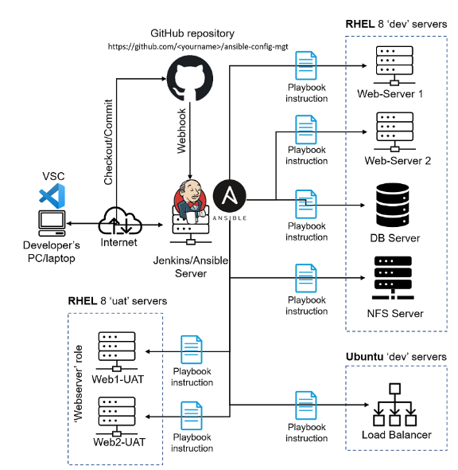

# Project_12_Ansible-Refactoring-Assignments-Imports
In this project you I will  continue working with ansible-config-mgt repository and make some improvements of the code. Ansible code will be Refactor, assignments created, and imports functionality will be explored. Imports allow to effectively re-use previously created playbooks in a new playbook – it allows  to organize  tasks and reuse them when needed.
### Code Refactoring
___
Refactoring is a general term in computer programming. It means making changes to the source code without changing expected behaviour of the software. The main idea of refactoring is to enhance code readability, increase maintainability and extensibility, reduce complexity, add proper comments without affecting the logic.

To Implement this Project the below steps are implemented;
* ANSIBLE REFACTORING AND STATIC ASSIGNMENTS (IMPORTS AND ROLES)
* REFACTOR ANSIBLE CODE BY IMPORTING OTHER PLAYBOOKS INTO SITE.YML
* CONFIGURE UAT WEBSERVERS WITH A ROLE ‘WEBSERVER’
* REFERENCE WEBSERVER ROLE

Below is the resulting Architecture after all the iterated steps above has been implemented.
